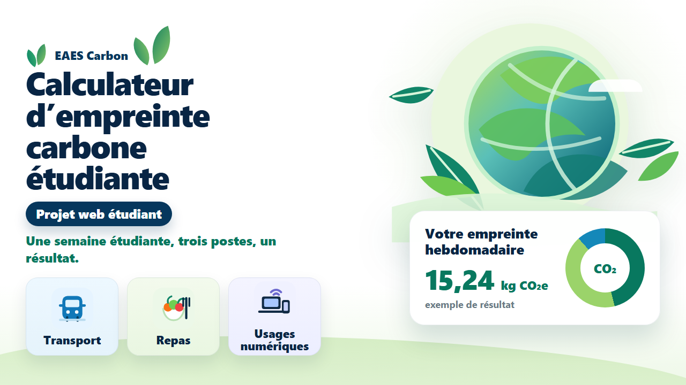

# Calculateur d’empreinte carbone étudiante

Projet web individuel réalisé dans le cadre de ma Licence MIASHS.

L’objectif de cette application est d’estimer l’empreinte carbone hebdomadaire d’un étudiant à partir de plusieurs catégories : transport, repas et usages numériques.

## Démo en ligne

Démo :  
https://anass-el-alaoui-es-sousy.github.io/calculateur-empreinte-carbone/index.html

## Aperçu

Le site propose une interface visuelle avec un mini-dashboard, un formulaire de calcul, une page de résultats et une page méthodologique.



## Fonctionnalités

* Formulaire de saisie des habitudes hebdomadaires
* Calcul automatique de l’empreinte carbone
* Affichage du total hebdomadaire en kg CO₂e
* Répartition par catégorie : transport, repas, usages numériques
* Dashboard dynamique basé sur les derniers résultats enregistrés
* Sauvegarde locale des données avec localStorage
* Page méthodologique expliquant les facteurs utilisés
* Interface responsive en HTML, CSS et JavaScript

## Technologies utilisées

* HTML
* CSS
* JavaScript
* localStorage
* SVG locaux

## Lancer le projet en local

Le projet ne nécessite pas d’installation particulière.

Il suffit d’ouvrir le fichier suivant dans un navigateur :

```text
index.html
```

Le projet peut aussi être lancé avec un serveur local simple si besoin.

## Structure du projet

```text
calculateur-empreinte-carbone/
├── index.html
├── README.md
├── assets/
│   ├── hero-planet.svg
│   ├── icon-transport.svg
│   ├── icon-meal.svg
│   ├── icon-digital.svg
│   ├── icon-co2.svg
│   ├── icon-chart.svg
│   └── miniature-eaes-carbon.png
├── js/
│   └── script.js
├── pages/
│   ├── calculateur.html
│   ├── resultats.html
│   └── methodologie.html
└── styles/
    └── style.css
```

## Compétences travaillées

* Développement web côté client
* Structuration d’une interface utilisateur
* Manipulation du DOM
* Gestion de formulaires
* Calculs automatiques en JavaScript
* Utilisation de localStorage
* Restitution visuelle de résultats
* Organisation d’un projet web statique
* Présentation d’un projet sur GitHub Pages

## Données et limites

Les résultats fournis par l’application sont des estimations pédagogiques.

Les facteurs utilisés sont volontairement simplifiés afin de proposer une lecture claire et rapide des principaux postes d’émission. Le projet n’a pas vocation à remplacer un outil officiel de bilan carbone.

Ce projet est un projet universitaire personnel. Il n’est affilié à aucun service officiel de calcul carbone.

## Sources méthodologiques

La page “Méthodologie” du site présente les principales sources et facteurs utilisés pour les calculs, notamment autour des postes transport, alimentation et usages numériques.

## Crédits des illustrations

Les illustrations et icônes SVG présentes dans ce projet ont été créées localement pour cette interface.
Aucune attribution externe n’est nécessaire.

## Statut

Projet universitaire terminé et publié sur GitHub Pages.

## Lien avec mon objectif professionnel

Ce projet montre ma capacité à structurer une application simple, traiter des entrées utilisateur, appliquer des règles de calcul, sauvegarder des données localement et restituer un résultat clair.

Ces compétences sont utiles pour des missions liées au test logiciel, à la validation de comportements attendus, à l’analyse de résultats et à l’amélioration d’outils techniques.
